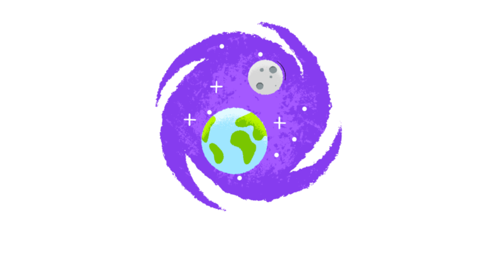

# form-ciencias-humanas

  
  

  
  

### 🚀 Technologies
- [Lunacy](https://icons8.com.br/lunacy)
- HTML5
- CSS3
- PHP7
- MYSQL
- [Animate.css](https://animate.style/)

Illustrations from [icons8](https://icons8.com/illustrations):
- [Earth care](https://icons8.com/illustrations/illustration/flame-earth-care) from [Anna Antipina](https://icons8.com/illustrations/author/6023f2cd123f99000e63cdd1)
- [Earth and Moon](https://icons8.com/illustrations/illustration/mirage-711) from [
Dmitry Nikulnikov](https://icons8.com/illustrations/author/5ddea3b001d036001345e529)

### 💻 Project
This is my biggest project so far, it's a test site with the human sciences theme. To take the test, you need to create an account and login. Right after taking the test, you are redirected to your account page, which displays your data and your final grade.

### 🔖 Layout
Here is the design [link](https://www.figma.com/file/zjzYIsjdEr6OnfpNBXEfRX/form-ciencias-humanas?node-id=0%3A1) for that project.

### 📝 License
This project is under the MIT license. See the file for more details.
https://github.com/Jolonte/WikiCraft/releases/tag/v1.0
